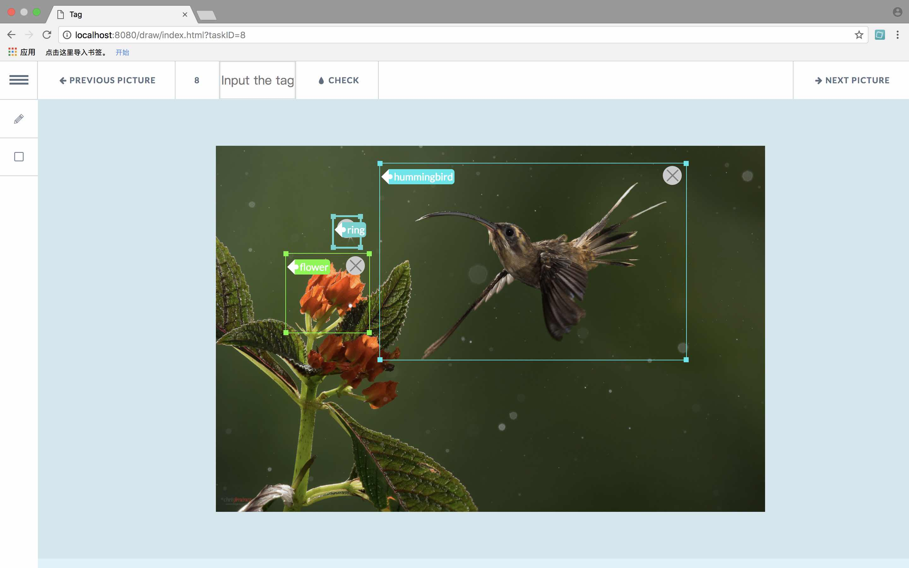
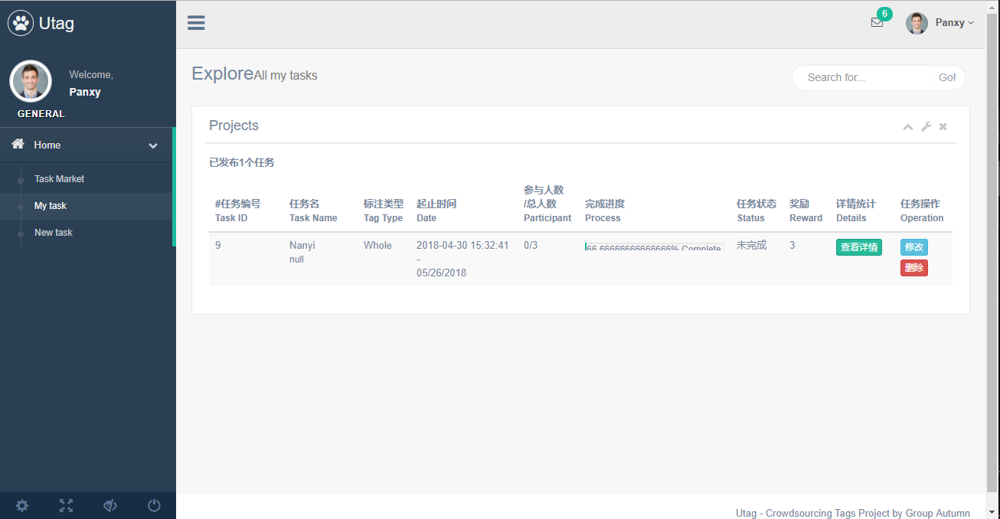
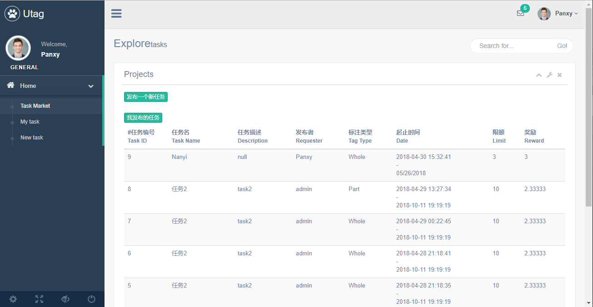
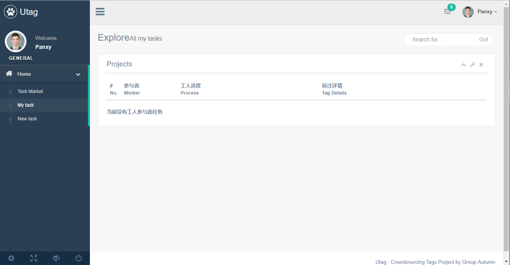
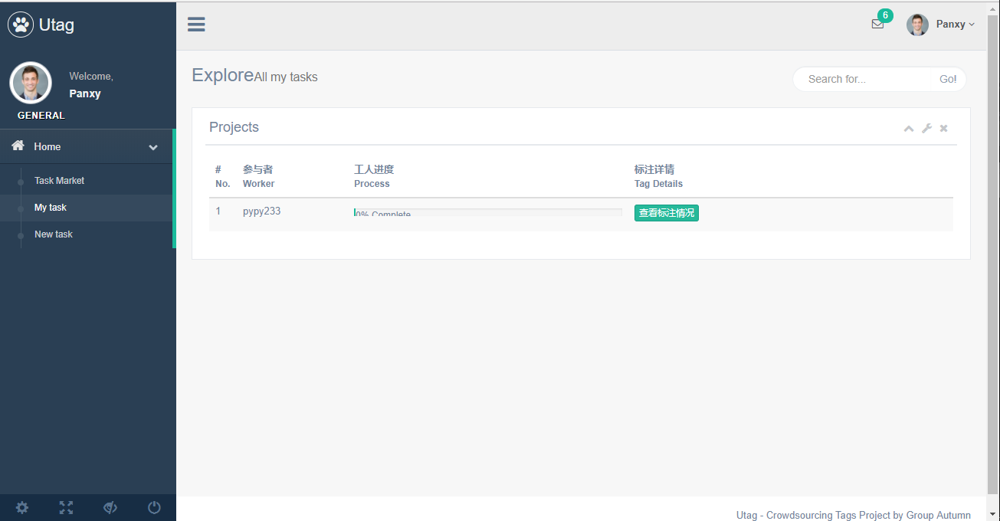
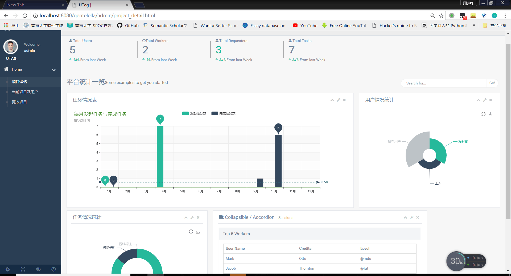
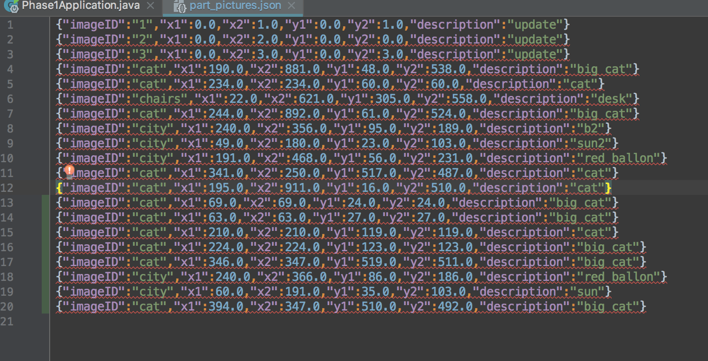

 
# UTag

## UTag - A Crowdsourcing Tags Tool(Version 2)

 
 
## Group Autumn
 
 

&nbsp;&nbsp;&nbsp;&nbsp;
 
 
[中文链接](ReadMEChinese.md)

&nbsp;&nbsp;
A web tag tool, Easy for configuration, Fully functional, Smooth interface, Quite flexible as the drawing tool on the PC. support gitlab Version control system,  test on Travis CI. you can get different tag experiences here.
## Requirments
<ul>
	<li>Bash(git、ssh)</li>
	<li>Java 8+</li>
	<li>maven 2.0+</li>
	<li>Chrome or Firefox</li>
</ul>

## Installation
### Method1:
<ol>
	<li>You can download the install folder from http://114.215.188.21/161250096_UTag/UTag_Phase_II.git</li>
	<li>Unzip folder "Utag_products.zip"</li>
	<li>Use command line to enter the folder</li>
	<li>Enter: java -jar Phase_I-0.0.1-SNAPSHOT.jar</li>
</ol>

###  Method2:
<ol> 
<li>You can download source file directly</li>
git clone http://114.215.188.21/161250096_UTag/UTag_Phase_II.git</li>
<li>
Then import or open the maven project.</li>
</ol>

## Quick Start
<ol>
<li>Enter: java -jar Phase_I-0.0.1-SNAPSHOT.jar or Run the class: PhaseIApplication.java</li>
<li>Use Chrome or Firefox open the url: http://localhost:8080/</li>
<li>Given a admin user(admin/admin exists), then user the default account to sign in.(Register frame is updated, so you can also register for a new user)</li>
<li>Use the tag frame to tag the picture loaded</li>
</ol>

## What is Different
Different from version1, we have done the following:
<ol><li>Add the register function, so that you can create your own account if necessary.
</li>
<li>New Module of task request and claim</li><li>
Cool tag!</li><li>Statistical charts can be seen in admin module.(Just use admin-admin to login)</li></ol>

## Introduction And Screenshots
Tag is similar to product1, any question, [read it](http://114.215.188.21/161250096_UTag/UTag_Phase_I/blob/master/README.md)
We change the ui to different parts to meet various tag requirments, like:

Let's move to task module, as a online tag platform, you can have a great experience of task. Claim or request, so simple:

 
 
 
View the details:

Or the admin get the information of he wants:

## Tag
<ul>
<li>Whole picture tag: Just enter the tag and check; 
	Directly rewrite the tag and check to update</li>
<li>Part picture tag: Use the box and enter the tag, then check;
	Click the related box area, rewrite the tag and check to update</li>
<li>Split Area: Use the pencil tool and split the picture
The line doesn't support the update, just redo or delete if necessary</li>
<li>All the data can be seen in folder, pictures can be downloaded from the server (The split area data is only stored as x.png )</li>
</ul>

## Demo
### Whole picture tag and update

## Data
The data can be seen in json files in resources/static/data, such as part_pictures.json

## Accident
When you use the system, sometimes it may occur "Nework warning" caused by loading too much file, just wait and refresh.
Any other problems, please send mails to panyuyuyu@outlook.com.

## To Do List
<ul>
<li>Travis CI integration</li>
<li>Configure variables</li>
<li>Support Docker</li>
<li>Open api</li>
<li>Command line</li>
</ul>

## Authors
* **Autumn.NJU**
* **Yu Pan(Pypy233)**
* **Xingyu Pan(PanxyCris)**
* **Ning Li(Yotta Lee)**
* **Dixin Chen(Cindy Chen)**

## License

This project is licensed under the Apache License - see the [LICENSE](LICENSE) file for details

## Acknowledgments

* Hat tip to anyone who's code was used
* ivan(GitHub project: draw)
* Kaihang Xie
* etc

