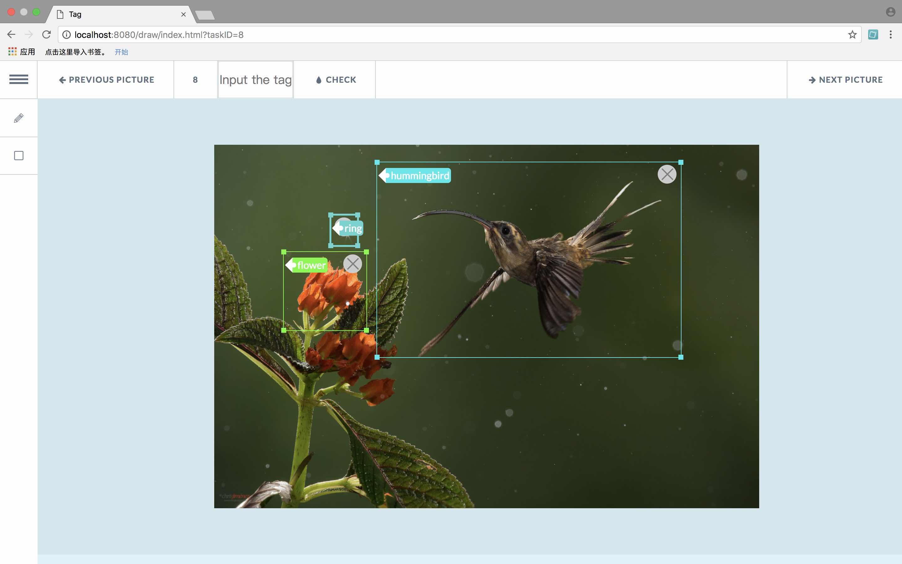
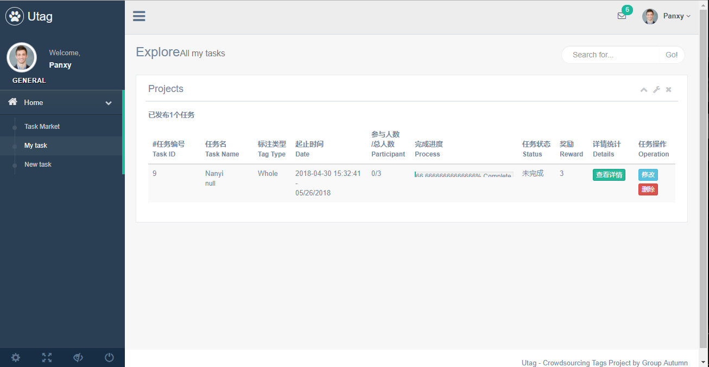
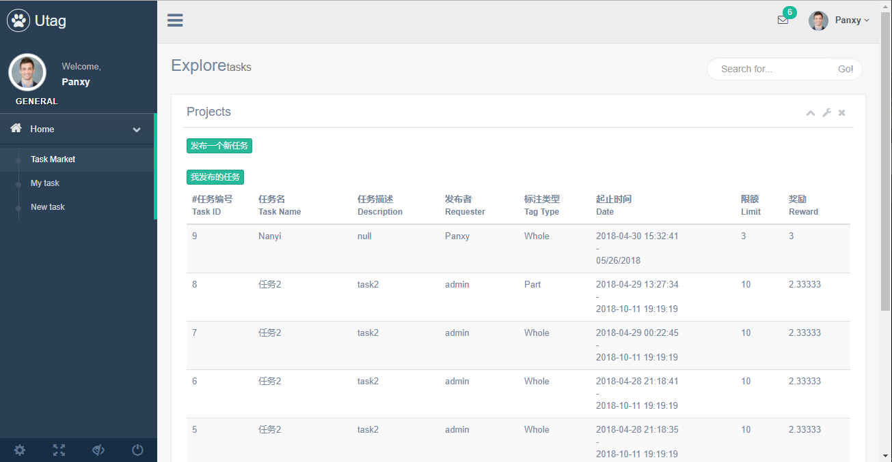
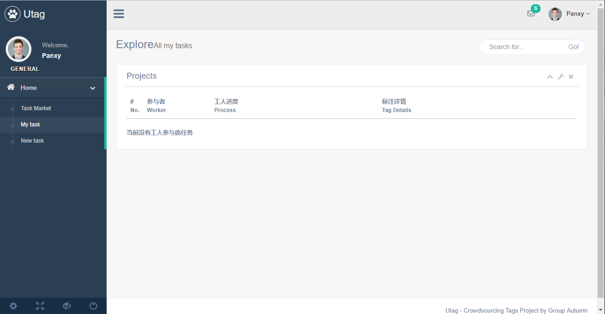
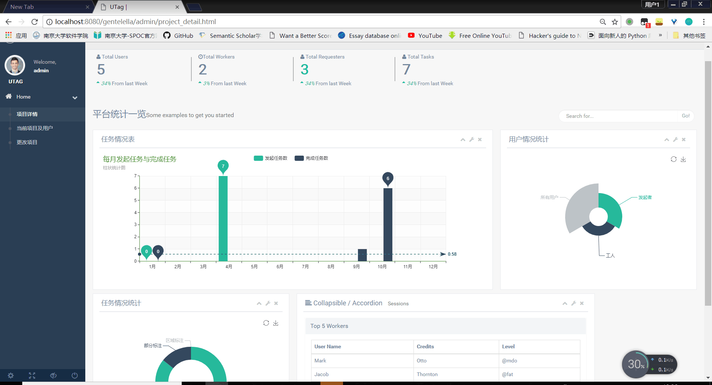
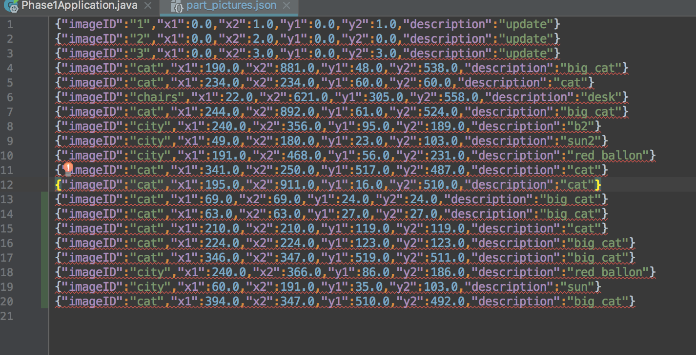

 
## UTag - 一个众包标注工具

 
## 南京大学Autumn工作组
 
 

&nbsp;&nbsp;&nbsp;&nbsp;
 
 
&nbsp;&nbsp;
一个web标注工具，配置简单，功能强大，交互体验流畅，像pc机的画图工具一样足够灵活。
由gitlab提供版本控制，在Travis CI上做测试，你可以在本系统中体验不一样的标注。
## 配置需要
<ul>
	<li>Bash(git、ssh)</li>
	<li>Java 8+</li>
	<li>maven 2.0+</li>
	<li>Chrome or Firefox</li>
</ul>

## 安装
### 方法1:
<ol>
	<li>下载项目压缩文件 http://114.215.188.21/161250096_UTag/UTag_Phase_I/blob/master/src.zip</li>
	<li>解压文件"Utag_products.zip"</li>
	<li>命令行进入"Utag_products.zip"目录</li>
	<li>输入命令: java -jar Phase_I-0.0.1-SNAPSHOT.jar</li>
</ol>

###  Method2:
<ol> 
<li>直接下载源文件</li>
git clone http://114.215.188.21/161250096_UTag/UTag_Phase_II.git</li>
<li>
作为maven项目导入</li>
</ol>

## 快速开始
<ol>
<li>运行Java入口类: Phase1Application.java</li>
<li>使用Chrome或者Firefox浏览器输入url: http://localhost:8080/</li>
<li>系统初始设定账户(admin/admin)，使用默认管理员账户登入(因为注册界面没做好，暂不支持注册)</li>
<li>使用标注界面加载和标注图片</li>
</ol>

## 大不同
和版本一相比，我们做了:
<ol><li>加入注册功能，有需要的筒子可以注册了
</li>
<li>任务发布和获取的新模块</li><li>
标注更炫酷！</li><li>数据可视化的统计图表(管理员用户admin-admin即可解锁)</li></ol>

## 介绍和截图
和产品一相同，任何标注问题, [阅读这里](http://114.215.188.21/161250096_UTag/UTag_Phase_I/blob/master/README.md)
我们的标注界面一分为几来应对不同情况:

让我们体验一下任务模块，一切都是那么与众不同

 
 
 
View the details:

管理员也许想得到他想要的:

## 介绍和截图
首先使用默认管理员账户(admin/admin)登录系统：

登录后跳转到标注界面:

 
左边一栏是辅助工具栏，包括:
<ul>
<li>
画线工具</li>
<li>方框框图工具</li>
<li>撤销</li>
<li>反撤销</li>
<li>删除整张图片</li>
<li>在网页上保存图片</li>
</ul>

在页面下半部分:
<ul>
	<li>"PREVIOUS PICTURE“和"NEXT PICTURE" 按钮控制加载图片</li>
	<li>输入文本框标注名</li>
	<li>"Check" 按钮保存标注名称</li>
</ul>

贴士:
	<ul>
	<li>如果你想更新标注，先单击对应部分，在文本框输入标注（在覆盖部分会出现白色提醒是更新的标注，我们建议多使用撤销而非单击更新）
	</li>
	<li>我们提供下载标注图片的服务，下载路径为默认网页下载路径
	
</li>
</ul>

## 标注
<ul>
<li>标注整张图: 输入标注，按下check按钮; 
	直接重新输入标注按下check按钮更新</li>
<li>图片部分标注: 使用方框输入标注，按下check按钮;
	点击对应方框区域重新输入标注按下check按钮更新</li>
<li>区域划分: 使用铅笔工具描线划分即可 (线条不支持更新，如果必要按redo或delete)</li>
<li>所有的数据储存在文件夹下的json文件里，图片可直接由服务器端下载到本地，区域划分不提供无意义的json存储，仅保留图片 (默认服务器一直处于运行状态)</li>
</ul>

## Demo
### 整张图片标注和更新

 
 

### 局部标注和更新

 
 

### 区域划分和更新

 
 

## Data
数据可以在 resources/static/data 下的json文件中看到, 如part_pictures.json

## 意外
当你使用本系统时，有时会出现由于加载过多文件导致的“Nework warning”报警，等待刷新即可。
如果遇到其它意外，请发送邮件到 panyuyuyu@outlook.com.

## 未来
<ul>
<li>Travis CI integration</li>
<li>Configure variables</li>
<li>Support Docker</li>
<li>Open api</li>
<li>Command line</li>
</ul>

## 作者
* **Autumn工作组**
* **潘羽(Pypy233)**
* **潘星宇(PanxyCris)**
* **李宁(Yotta Lee)**
* **陈迪新(Cindy Chen)**

## License

工程是Apache2.0工程 - 查看[证书详情 ](LICENSE) 
## 感谢
* 向被使用代码的人表示感谢
* ivan(GitHub工程 draw)
* gentella
* etc

